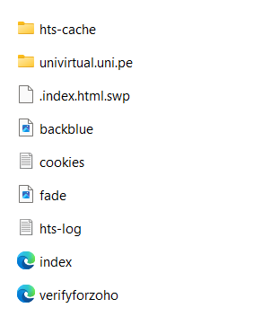

# Educational Phishing Simulation Project on uni.pe domains

## Description

This project aims to educate about cybersecurity techniques and raise awareness about data protection through a phishing simulation. The campaign was conducted in a controlled environment strictly for educational purposes.

## Steps Performed

1. **Website Cloning:**
    - **Tool Used:** HTTrack
        
        ```bash
        sudo apt install httrack
        ```
        
    - **Description:** The login page of UNI VIRTUAL was cloned for educational purposes using the following command:
        
        ```bash
        httrack "<https://univirtual.uni.pe>" -O "/path/to/destination_directory" "+*.univirtual.uni.pe/*" -v
        ```
        
    - Navigate to the folder where the following files were saved:
        
        
        
    - Go to the address: [univirtual.uni.pe](http://univirtual.uni.pe/)>login: edit the index.html file, change:
        
        ```bash
        <form class="login-form" action="datos.php" method="post" id="login"> //edit here to change the action address
              <input type="hidden" name="logintoken" value="ena2rErZaHDJnGB9UiWAWDOZAmFVDxmz" />
              <div class="login-form-username form-group">
                <label for="username" class="sr-only">Username or email address</label>
                <input type="text" name="username" id="username" class="form-control form-control-lg" value=""
                  placeholder="Username or email address" autocomplete="username" />
              </div>
              <div class="login-form-password form-group">
                <label for="password" class="sr-only">Password</label>
                <input type="password" name="password" id="password" value=""
                  class="form-control form-control-lg" placeholder="Password"
                  autocomplete="current-password" />
              </div>
              <div class="login-form-submit form-group">
                <button class="btn btn-primary btn-block btn-lg" type="submit" id="loginbtn">
                  Log In
                </button>
              </div>
              <div class="login-form-forgotpassword form-group text-center">
                <a href="forgot_password.html">Forgot your password?</a>
              </div>
              <div class="login-signup text-center">
                Don't have an account?
                <a href="signup.html">Create a new account</a>
              </div>
         </form>
        
        ```
        
2. **Domain and SSL Certificate Creation:**
    - **Provider Used:** InfinityFree
    - **Description:** Free domain registration and SSL certificate configuration. Necessary DNS records were set up.
    
    
    
    Domain: [pituni.000.pe](http://pituni.000.pe/)
    
    
    
3. **Email Configuration:**
    - **Provider Used:** Gmail
    - **Description:** Creation of an email account to manage the campaign and SMTP parameter configuration in Gophish.
        
        
        
4. **Gophish Installation and Configuration:**
    - **Tool Used:** Gophish
    - **Description:** Configuration of Gophish with email template, recipient groups, and landing page.
        
        We initialize the service
        
        
        
        Then navigate to the path where Gophish is located and execute `gophish.exe` (run as administrator):
        
        
        
5. **Landing Page Development:**
    - **Description:** Setting up a landing page in Gophish using the cloned page.
        
        
        
6. **User & Groups**
    
    This is where we will enter the email addresses to target, in our case with the domain [uni.pe](http://uni.pe/).
    
    
    
7. **Edit Sending Profile:**
    
    
    
    Where:
    
    - SMTP From: The email address from which malicious emails will be sent.
    - Host: The SMTP server of Gmail, indicated by `smtp.gmail.com:465`
    - Username and password: The email address and password for authentication.
8. **Edit Template**
    - In this section, we will enter the email subject as well as the body, which is an email similar to those sent by [pituni.pe](http://pituni.pe/).


1. **Campaign Execution:**
    - **Description:** Execution of the phishing campaign from the local server and monitoring of metrics and results.
    
    
    
    ## Results:
    
    The attached image shows the results of the campaign:
    
    - 1 email sent
    - 1 email opened
    - 1 link clicked
    - 1 data submitted
    - 0 emails reported

### Legal and Ethical Considerations

- All policies and terms of use of the services used were respected.
- The campaign was conducted in a localhost environment with no intention to cause harm or fraud.
- Permission was obtained for the use of the cloned page and the execution of the phishing campaign.

### Repository Structure

- `index.html`: Cloned login page.
- `datos.php`: Script to capture login data.
- `configuración_gophish.json`: Gophish configuration.
- `README.md`: Project documentation.

### References

- [InfinityFree Terms of Service](https://www.infinityfree.com/terms/)
- HTTrack Documentation
- Gophish Documentation

### Usage Instructions

1. **Clone the Repository:**
    
    ```bash
    git clone <https://github.com/your-username/your-repository.git>
    
    ```
    
2. **Local Server Configuration:**
    - Set up a local server (e.g., XAMPP, WAMP) and copy the project files into the server's directory.
3. **Campaign Execution:**
    - Configure and execute Gophish using the parameters provided in `configuración_gophish.json`.